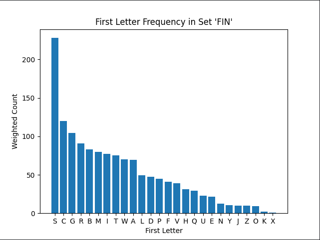

# MTG Sorter Helper

A desktop application to help Magic: The Gathering collection sorting and analyzing sets.

## Features

- **Collection Management**: Import ManaBox CSV exports and create hierarchical sorting plans
- **Set Analysis**: Analyze letter frequency in MTG sets to optimize card sorting strategies
- **Card Data Management**: Cache and manage card data from the Scryfall API
- **Hierarchical Sorting**: Create nested sorting plans based on configurable criteria
- **Progress Tracking**: Track sorting progress with visual indicators




## Requirements

- Python 3.8+
- PyQt6
- Internet connection for Scryfall API access

## Installation

1. Clone the repository:

```bash
git clone https://github.com/Popcorn8493/mtg-sorter-helper.git
cd mtg-sorter-helper
```

2. Install dependencies:

```bash
pip install -r requirements.txt
```

## Usage

### Running the Application

```bash
python mtg-sorter-help.py
```

### Command Line Options

```bash
python mtg-sorter-help.py --debug                    # Enable debug logging
python mtg-sorter-help.py --theme light            # Start with light theme (default: dark)
python mtg-sorter-help.py --clear-cache            # Clear cache on startup
python mtg-sorter-help.py --import file.csv        # Import collection on startup
python mtg-sorter-help.py --no-splash              # Skip splash screen
python mtg-sorter-help.py --safe-mode              # Start with minimal features
```

## Architecture

The application follows a layered architecture with clear separation of concerns:

```
UI Layer (PyQt6 widgets)
├── main_window.py - Main application window with tab management
├── sorter_tab.py - Collection sorting interface
├── analyzer_tab.py - Set analysis interface
└── custom_widgets.py - Reusable UI components

Core Business Logic
├── sorter_planner.py - Hierarchical sorting algorithm
├── project_manager.py - Project persistence and state management
└── models.py - Data models (Card, SortGroup)

API/Data Layer
└── scryfall_api.py - Scryfall API integration with caching

Workers/Threading
└── threads.py - Background task management
```

## Key Components

- **SorterPlanner**: Creates hierarchical sorting plans based on configurable criteria
- **ScryfallAPI**: Manages all interactions with the Scryfall API with intelligent caching
- **Card Models**: Represents individual MTG cards with quantity tracking and sort state
- **Project Management**: Handles saving/loading of collection projects in JSON format

## License

MIT License - see LICENSE file for details.
