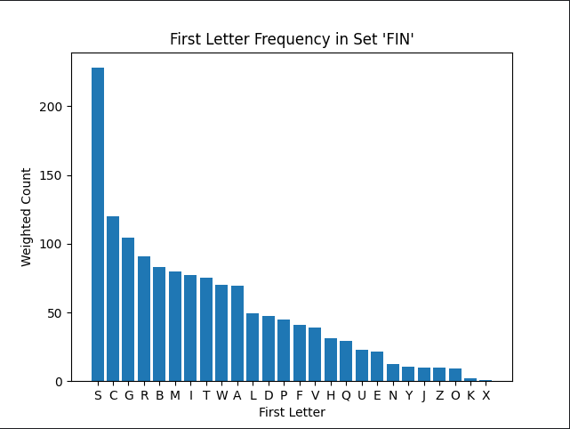

# MTG Set Letter Analyzer

Python tool for analyzing the frequency of starting letters in card names from a Magic: The Gathering set, with optional rarity-based weighting. This helps optimize how to sort large piles of cards by starting with the letters that occur most frequently.

## Features

- Pulls card data directly from the Scryfall API
- Automatically caches data to avoid repeated downloads
- Weights card counts by rarity (commons, uncommons, rares, mythics)
- Supports “Play Booster” rarity distributions
- Interactive GUI built with Tkinter
- Optional CSV export and visual bar chart display

## Example

> __

## Requirements

Install the necessary dependencies:

```bash
pip install -r requirements.txt
